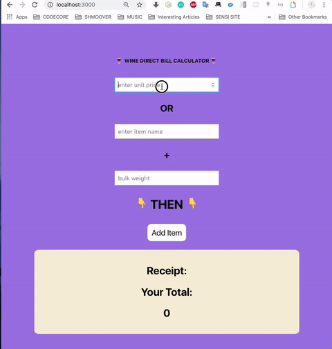

This project was bootstrapped with [Create React App](https://github.com/facebook/create-react-app).

## WINE DIRECT CASH REGISTER APP

### BUILT USING REACT AND REACTSTRAP FOR BUTTONS AND FORMS

#### ASSUMPTIONS AND APPROACH:

* Wanted to create two different input options:

1. Scanning a generic item that only had a price
2. Scanning an item that had a name and associated weight

* Items scanned with a name and weight are then checked against an inventory that contains a name and a price per weight metric

* Items are then added to the bill-receipt and a total-running price is tabulated
* If the price tops a certain threshold value (in this case $300) then a option to apply a 10% discount is shown
* The discount can only be applied once
* If no items are entered or an item that is not in inventory, a message is displayed to the user

#### Was not able to tackle the buy 2 get 1 free feature

* my approach for that was going to be to compare each incoming 'named' item and check if it already exists in the 'receipt' object, if so, trigger a function that would subtract the price of one of the items from the receipt-bill
* the difficulty would be in ensuring that the function is not applied to the same items if another of those items is purchased
* I would assume that the customer can only a apply a buy-1-get-1-free feature once per bill

